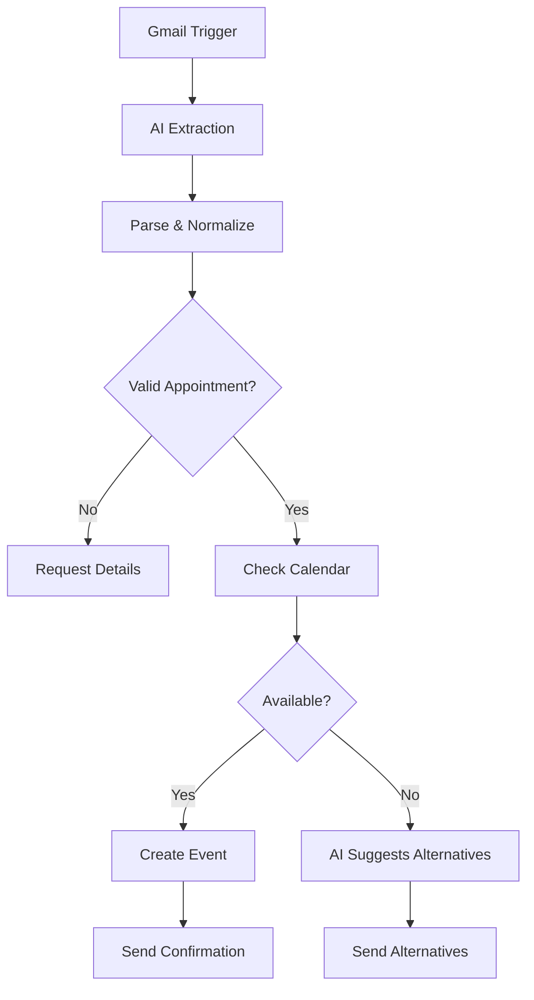

# Medical Appointment Scheduler - n8n Workflow

Automated AI-powered appointment booking system that processes email requests, validates availability, and manages Google Calendar scheduling.

## 🎯 Overview

This workflow monitors Gmail for appointment requests, extracts booking details using AI, checks calendar availability, and automatically responds with confirmations or alternative time slots.

## ✨ Key Features

- **Automatic email monitoring** - Polls Gmail every minute for new appointment requests
- **AI-powered parsing** - Extracts patient details (name, email, date, time) from natural language
- **Smart time normalization** - Rounds to 30-minute slots (08:00, 08:30, etc.)
- **Real-time availability checking** - Queries Google Calendar for conflicts
- **Intelligent fallback** - AI agent suggests 3 alternatives when slots are booked
- **Multi-language support** - Responds in the sender's language
- **Conversation context** - Maintains memory across email threads

## 📋 Prerequisites

- n8n instance (v1.0+)
- Gmail account with OAuth2 access
- Google Calendar API enabled
- DeepSeek API account

## 🔑 Required Credentials

| Credential | Type | Purpose |
|------------|------|---------|
| `gmailOAuth2` | Gmail OAuth2 | Read/send emails |
| `googleCalendarOAuth2Api` | Google OAuth2 | Calendar access |
| `deepSeekApi` | API Key | AI language model |

## 🏥 Business Rules

### Time Slots
- **Available times**: 08:00 - 15:30
- **Interval**: 30 minutes (XX:00 or XX:30 only)
- **Duration**: 1 hour per appointment
- **Timezone**: UTC+01:00

### Time Rounding Logic
```
0-15 min  → :00
16-45 min → :30
46-59 min → next hour :00

Examples:
08:17 → 08:30
09:45 → 10:00
14:20 → 14:30
```

### Business Hours
- **Open**: 08:00 - 16:00
- **Closed flag**: Triggered for requests outside these hours

## 🔄 Workflow Logic



## 📦 Node Breakdown

### 1. Gmail Trigger
- Polls every minute (no sender filter - processes all emails)
- Captures: From, snippet, id, threadId

### 2. Basic LLM Chain (DeepSeek)
Extracts structured JSON:
```json
{
  "date": "2025-11-14",
  "time": "09:00:00",
  "patient_name": "John Doe",
  "patient_email": "john@example.com",
  "appointment": true,
  "Closed": false
}
```

### 3. Code in JavaScript
- Cleans LLM output (removes markdown, escapes)
- Normalizes datetime to ISO format
- Validates date/time presence
- Calculates end time (+1 hour)
- Output: Calendar-ready event object

### 4. Switch1
Routes based on `appointment` boolean:
- **False** → Request more info
- **True** → Proceed to availability check

### 5. Get availability in a calendar
Queries Google Calendar for conflicts in the requested time window

### 6. If Node
Branches on `available` status:
- **True** → Create event path
- **False** → AI agent path

### 7. Create an event
Books appointment with:
- Summary: Patient email
- Start/End: ISO datetime
- Calendar: `douaneamar.2000@gmail.com`

### 8. AI Agent (Alternative Times)
- Uses calendar tool to fetch free slots
- Suggests 3 alternatives
- Maintains conversation memory via threadId
- Matches original email language

## 📧 Response Examples

### ✅ Successful Booking
```
Le rendez-vous a été pris à :

14 novembre 2025 à 09:00

Merci
```

### ❌ Missing Information
```
Veuillez choisir la date et l'heure de votre rendez-vous. Merci
```

### 🔄 Time Conflict
```
Désolé, ce créneau est déjà réservé.

Disponibilités:
1. 14 novembre à 09:00
2. 14 novembre à 14:30
3. 15 novembre à 10:00

Lequel vous convient?
```

## 🚀 Setup Instructions

1. **Import Workflow**: Load JSON into n8n
2. **Configure Credentials**:
   - Gmail OAuth2
   - Google Calendar OAuth2
   - DeepSeek API key
3. **Update Calendar ID**: Replace `douaneamar.2000@gmail.com` in nodes:
   - Get availability in a calendar
   - Create an event
   - Get availability in a calendar in Google Calendar
4. **Activate Workflow**: Enable the workflow trigger

## ⚙️ Configuration Options

### Polling Frequency
Change in `Gmail Trigger` node:
```json
"pollTimes": {
  "item": [{"mode": "everyMinute"}]
}
```

### Email Filtering
Add sender filter in `Gmail Trigger`:
```json
"filters": {
  "sender": "specific@email.com"
}
```

### Time Slot Intervals
Modify in `Basic LLM Chain` prompt and rounding logic in `Code in JavaScript`

## 🔍 Troubleshooting

| Issue | Solution |
|-------|----------|
| AI returns invalid JSON | Check DeepSeek API quota, review prompt |
| Calendar not updating | Verify OAuth2 token refresh, check calendar permissions |
| Wrong timezone | Update `+01:00` offset in JavaScript code |
| Memory not working | Ensure threadId is correctly captured |

## 🎯 Limitations

- Single calendar support only
- Assumes year 2025 if unspecified
- French default responses
- No cancellation/reschedule handling
- 1-hour fixed appointment duration

## 🔮 Future Enhancements

- [ ] Multi-calendar management
- [ ] SMS/WhatsApp notifications
- [ ] Appointment cancellation workflow
- [ ] Patient database integration
- [ ] Configurable appointment durations
- [ ] Waitlist management
- [ ] Recurring appointments
- [ ] Reminder system (24h before)

## 📝 Notes

- **Memory**: Uses email `threadId` for conversation context
- **Error handling**: Falls back to generic responses on parsing failures
- **Language detection**: Matches sender's language automatically
- **Security**: All credentials managed via n8n credential system

## 📄 License

This workflow is provided as-is for educational/commercial use.
